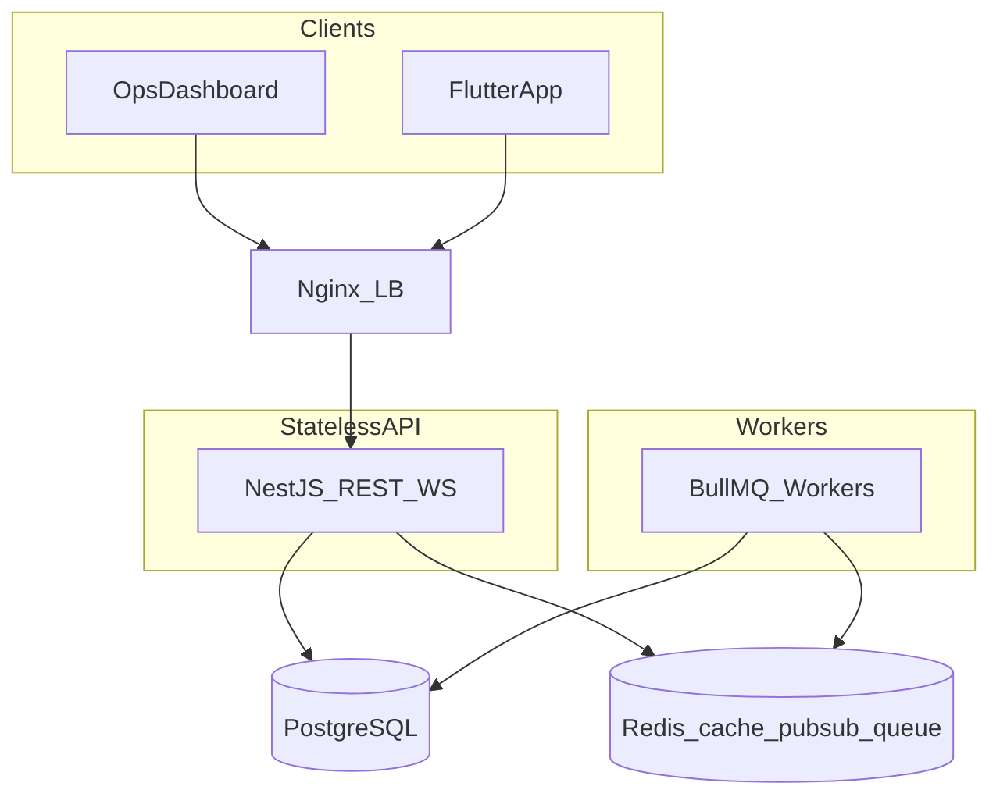
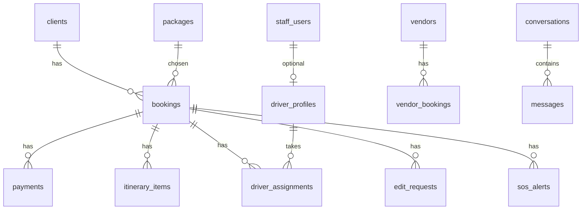

# Zeengo Backend — SR-Grade Implementation Plan

## Goal

Build the NestJS API in [zeengo_backend](https://github.com/codecrafteryt/zeengo_backend) to match `BACKEND_SPEC.md` / `TECHNICAL_SPEC.md` / `USER_FLOW.md` with **clean domain modules, a frozen efficient Postgres schema, reusable shared kernels, and millisecond-class hot paths** (cache + indexes; AI/push/email never on the request path).

This document is the shared source of truth for the team.

---

## Locked decisions (no optionality)

| Topic | Decision |
|---|---|
| Stack | NestJS + TypeScript + Prisma + PostgreSQL 16 + Redis + BullMQ + Socket.IO (as BACKEND_SPEC) |
| Client model | **1 client : many bookings**; create booking **find-or-create client by phone** |
| Money | `paidAmount` / `dueAmount` **derived** from `payments` where `status='paid'`; optional Redis cache, never a second write source |
| Validation | `zod` + thin Nest pipe (shared schemas, less DTO boilerplate than class-validator) |
| ORM access | Domain **services use PrismaService directly** — no repository layer (avoids empty wrapper boilerplate) |
| API shape | Envelope `{ success, data, meta? }` / `{ success: false, error }` under `/api/v1` |
| Auth | Staff email/password; client phone + OTP; JWT access 15m + rotated refresh in Redis |
| Soft delete | Only where spec marks `deleted_at` (packages, vendors, staff, clients) |
| GPS | Latest in Redis `driver:gps:{id}`; history batched to `gps_pings` |
| Comments | Short **why** comments on non-obvious business rules only — not noise |

---

## Architecture



**Module layout:**

```
src/
  main.ts
  app.module.ts
  common/           # response envelope, zod pipe, errors, pagination, guards, decorators
  prisma/           # PrismaModule + PrismaService
  redis/            # RedisModule
  auth/
  users/
  clients/
  bookings/
  packages/
  itineraries/
  drivers/
  vendors/
  payments/
  edit-requests/
  vip/
  sos/
  tasks/
  chat/
  notifications/
  ai/
  dashboard/
  webhooks/
  realtime/
  jobs/
```

**Per-domain file pattern:**

```
bookings/
  bookings.module.ts
  bookings.controller.ts
  bookings.service.ts
  bookings.schema.ts      # zod request/query schemas
  bookings.mapper.ts      # DB row → API DTO (single place)
```

Skip empty `*.repository.ts`, `*.interface.ts`, `dto/` folders with one-liner classes.

---

## Code quality rules (team must follow)

1. **One business action = one service method** (e.g. `approveEditRequest`, `recordCashPayment`).
2. **Controllers thin** — auth/role + parse + call service + map response.
3. **Shared kernel only in `common/`** — `PaginateQuery`, `ApiResponse`, `AppError`, `@Roles()`, `@CurrentUser()`.
4. **Naming:** DB `snake_case` (Prisma `@map`); API JSON `camelCase`; enums Prisma native enums matching spec (`BookingStatus`, `PaymentStatus`, …).
5. **Transactions** for multi-write flows (booking+ZN, VIP activate, edit approve, Stripe paid).
6. **RBAC:** `RolesGuard` + **row scoping inside services** (client own booking; driver own assignments).
7. **No N+1:** list endpoints use `include` / explicit selects; dashboard KPIs Redis-cached 15–30s.
8. **Heavy work → BullMQ** (`translation`, `push`, `ai`, `payments`, `digest`, `cleanup`).
9. **Idempotent webhooks** — store Stripe `event.id` before applying status.
10. **Beginner-readable** — clear names, early returns, no deep nesting, map complex responses in `*.mapper.ts`.

---

## Database (freeze before feature coding)

Prisma schema in `prisma/schema.prisma` implementing BACKEND_SPEC §2 with these hardenings:

- UUID PKs + `createdAt`/`updatedAt`; soft delete where specified.
- Money: `Decimal(12,2)`; never float.
- ZN codes: Postgres sequence `zn_seq` + `'ZN' || lpad(...)` **inside booking create transaction**.
- Indexes exactly as spec (status, `client_id`, `arrival_date`, `zn_code`, payment filters, itinerary date, SOS, messages cursor, etc.).
- `conversation_participants`: proper composite unique on `(conversationId, participantType, staffId|clientId)` — no broken coalesce PK.
- `paidAmount` not a column on `bookings` — compute via aggregate (cache in Redis key `booking:{id}:paid` on payment write).
- Seed: admin user, sample packages (Love/Family/Relaxation/Royal), settings (`vip_price`, Stripe expiry).



---

## Performance contract

| Path | Target approach |
|---|---|
| Auth / CRUD / lists | Indexed queries + select-only fields; p95 low tens of ms locally |
| Dashboard summary | Single aggregated query or parallel counts + **Redis TTL 30s** |
| Live driver positions | Redis only |
| Chat send | Persist + emit WS immediately; translation job patches later |
| AI / FCM / email | Queue only; HTTP returns job id or cached short result |

---

## Build phases (implementation order)

### Phase 0 — Foundation kit
- Env template `.env.example`, Docker Compose (`postgres` + `redis`) for local.
- Prisma init + full schema + first migration + seed.
- `common/`: envelope interceptor, `AppError` filter, zod validation pipe, pagination helpers, JWT + Roles guards.
- `PrismaModule`, `RedisModule`, health `GET /api/v1/system/health`.
- Config module (typed env).

### Phase 1 — Auth + users + settings
- Staff login / refresh / logout / me / change-password.
- Client register → OTP → verify; login; forgot/reset.
- Refresh token rotation in Redis; argon2id passwords.
- User management CRUD (admin); creating `role=driver` also creates `driver_profiles`.
- Settings key-value.

### Phase 2 — Core domain
- Packages CRUD (soft delete).
- Bookings CRUD + ZN generator + client find-or-create.
- Checklist + notes.
- Itinerary items CRUD + daily-operations + week counters.
- Clients read/update.

### Phase 3 — Money
- Cash / Rajhi / USDT record (`status=paid`).
- Stripe payment links + webhook (sent → opened → paid / expire job).
- Splizer endpoints + finance summary/charts aggregates.
- WS `payment.*` + notifications enqueue.

### Phase 4 — Field ops
- Drivers roster, assignments, status, GPS (WS + Redis), live positions.
- Tasks CRUD/complete.
- Dashboard + ops-room aggregates (cached).

### Phase 5 — Client interactions
- Edit requests + VIP activate/request (approve VIP reuses edit pipeline).
- SOS create/resolve + fan-out.
- Chat conversations/messages + translation queue.
- Notifications + FCM worker.

### Phase 6 — AI + harden
- Parse itinerary, chatbot, email draft, EOD (BullMQ `ai` queue).
- Audit logs on sensitive writes.
- Rate limits (auth/OTP/AI), OpenAPI export, basic e2e for auth + booking + payment webhook.
- Load-conscious notes for GPS/chat.

---

## Definition of Done (every module)

- Matches API contract paths/shapes in BACKEND_SPEC §4.
- RBAC matrix enforced (route + row scope).
- No N+1 on list endpoints; indexes used for filters.
- Zod schemas for input; mapper for output.
- Side-effects (WS/notify/jobs) documented in service method header comment when non-obvious.
- Happy-path unit or e2e coverage for money/auth/SOS critical paths.

---

## Related team docs

- [`FOLDER_STRUCTURE.md`](./FOLDER_STRUCTURE.md) — domain folders vs dashboard / app / shared
- [`API_REFERENCE.md`](./API_REFERENCE.md) — all 111 APIs, roles, bodies, JWT cheat-sheet

## Out of scope for this backend repo

- React/Vite dashboard UI and Flutter app (consume OpenAPI only).
- Production infra provisioning beyond Compose for local + env docs.

---

## Local setup

```bash
cp .env.example .env
# Prefer Docker (Postgres 5432 + Redis 6379):
docker compose up -d
# Or local Homebrew: Postgres@16 on 5433 + redis-server; set DATABASE_URL port to 5433
npm install
npm run db:setup
npm run start:dev
```

API base: `http://localhost:3000/api/v1`  
Health: `GET /api/v1/system/health`  
OpenAPI: `http://localhost:3000/api/docs`  
Seed admin: `admin@zeengo.com` / `Admin123!`
